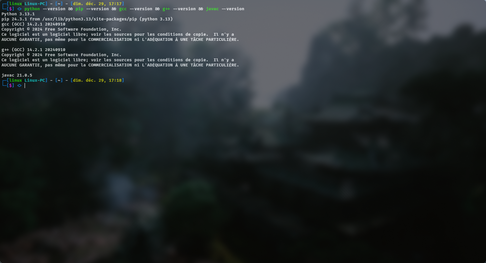
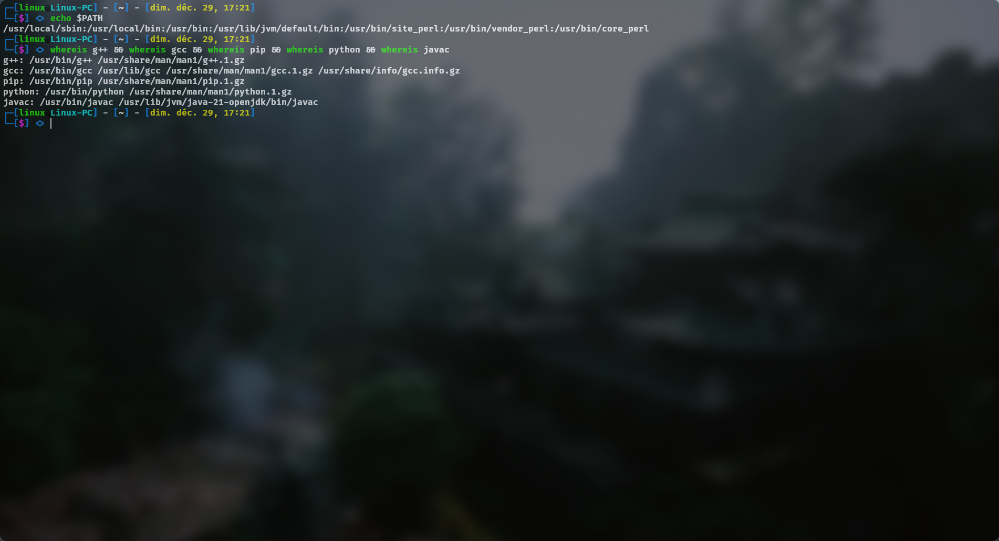

🔧 - Instructions détaillées d'installation -

🐧 - Arch Linux - : 

    </> $ sudo pacman -Syu python python-pip gcc base-devel jdk-openjdk

🎩 - Fedora - : 

    </> $ sudo dnf update --refresh -y && sudo dnf install -y python3 python3-pip gcc g++ java-17-openjdk-devel

🍥 - Debian / Ubuntu - : 

    </> $ sudo apt update && sudo apt install -y python3 python3-pip gcc g++ openjdk-17-jdk

🍎 - MacOS - : 

    </> $ /bin/bash -c "$(curl -fsSL https://raw.githubusercontent.com/Homebrew/install/HEAD/install.sh)"
    </> $ brew install python gcc openjdk

🪟 - Windows - :

    Python : 

    Téléchargez l'installateur Python depuis : python.org ou sur le Microsoft Store (Windows 10 et 11).
    Pendant l'installation, cochez l'option "Add Python to PATH".
    Puis installez pip : https://bootstrap.pypa.io/get-pip.py puis python3/python get-pip.py
    
    GCC et G++ (avec MinGW) :

    Téléchargez MinGW sur : https://sourceforge.net/projects/mingw/
    Ajoutez le répertoire bin de MinGW à la variable d'environnement PATH : C:\MinGW\bin.

    OpenJDK (pour javac) :

    Téléchargez l'installateur OpenJDK depuis : https://download.oracle.com/java/23/latest/jdk-23_windows-x64_bin.exe
    Ajoutez le chemin d'installation à la variable PATH si ce n'est pas déjà fait : C:\Program Files\Common Files\Oracle\Java\javapath\

🔧 Vérifiez les versions et que les programmes sont bien installé dans le $PATH : 

    </> $ python --version (version 3)
    </> $ pip --version
    </> $ gcc --version
    </> $ g++ --version
    </> $ javac --version

-------------------------------------------------------------------------------------------------------------------------------

					                       📷 - Image - :

  
  
  

