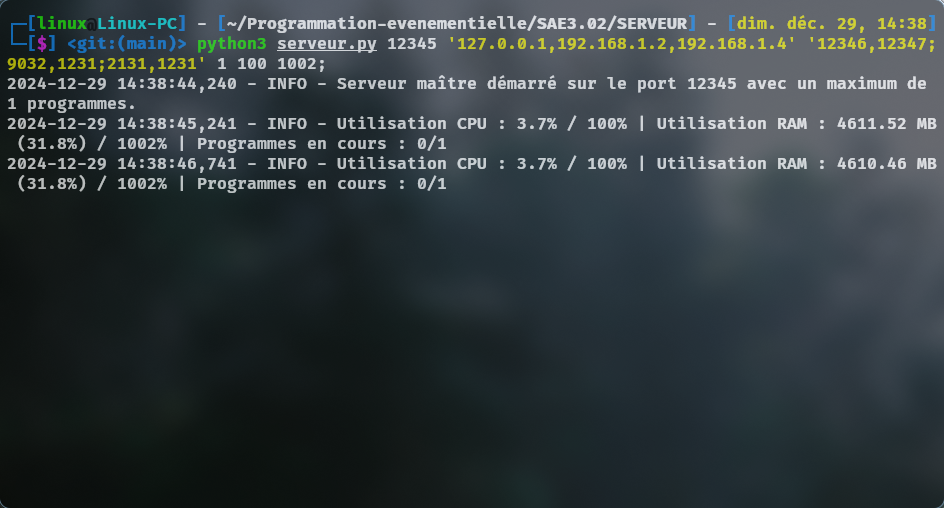
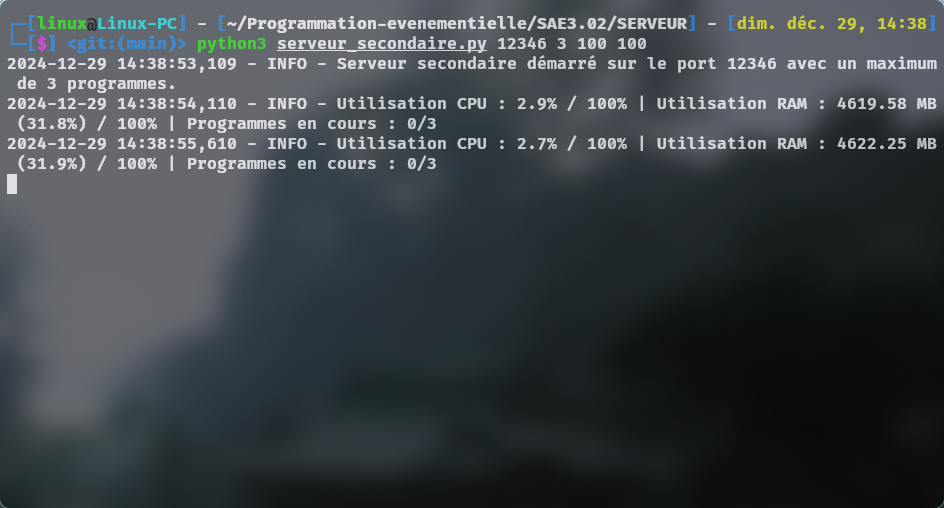
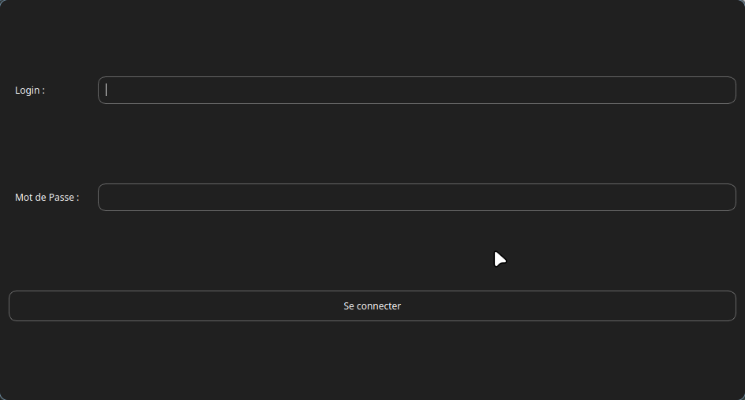
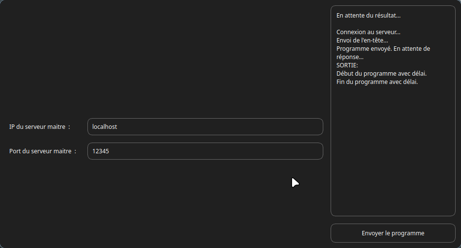

🛠️ Projet : Cluster de Calcul avec du Load-Balancing

							🎥 -Démonstration- : 
	
 ▶️ -[Regarder la vidéo](https://drive.google.com/file/d/1bKXcfdShKR9zl6xLlGAzUsQhfO8umSdE/preview)-
	

📜 -Description- :

	// Ce projet met en œuvre une architecture multi-serveurs permettant de compiler et d'exécuter des programmes soumis par des clients. Le serveur maître gère les connexions et distribue les tâches aux serveurs secondaires pour équilibrer la charge. //

💡 -Fonctionnalités- :

	* Gestion des clients multiples via une interface graphique.
	* Compilation et exécution de programmes en Python, Java, C et C++.
	* Répartition dynamique de la charge.
	* Surveillance des ressources CPU et RAM et Max Programmes.
	* Robustesse avec gestion des échecs de connexion.
	* Sécurité renforcée avec chiffrement du header via une clé partagée..

📦 -Pré-requis- :

	* Python 3.8+ (inclus dans le $PATH en python3 pour Unix/Linux/MacOS et python pour Windows avec le python-3.12.8-amd64.exe Win32 ou python3/python avec le Microsoft Store)
	* PIP si il n'est pas inclut dans python avec https://bootstrap.pypa.io/get-pip.py puis python3/python get-pip.py
	* Modules : voir requirements.txt
	* Compilateurs pour C et C++ et Java (GCC, G++, OpenJDK-Devel (javac) inclus dans le $PATH)
	* Vérifiez sur votre Terminal/CMD que tous ses programmes se lance correctement avant de lancer les serveurs (python3/python en version 3 et non 2, gcc, g++, javac)

🔧 -Installation- :

	* 🏠 Clonez ce dépôt :
	
	</> $ cd ~
	</> $ git clone https://github.com/Bastiantkt/Programmation-evenementielle.git

	* 🛠 Installez les dépendances :
	
	</> $ cd ~
	</> $ cd Programmation-evenementielle/SAE3.02/
	</> $ pip install -r requirements.txt --break-system-packages

🚀 -Démarrage- :

	* 🌐 -Serveur Maître- :
	
	</> $ cd ~
	</> $ cd Programmation-evenementielle/SAE3.02/SERVEUR/
	</> $ python3 serveur.py <port_maitre> '<ips_autres>,<ips_autres>' '<ports_autres>;<ports_autres>' <max_programmes> <max_cpu_usage> <max_ram_usage>

	⚠️ -Example- : </> $ python3 serveur.py 12345 '127.0.0.1,192.168.1.2' '12346,12347;12348,12349' 2 50 80

-------------------------------------------------------------------------------------------------------------------------------

					                       📷 -Image- :

 

-------------------------------------------------------------------------------------------------------------------------------	
	
	* 🌐 -Serveur Secondaire- :
	
	</> $ cd ~
	</> $ cd Programmation-evenementielle/SAE3.02/SERVEUR/
	</> $ python3 serveur_secondaire.py <port> <max_programmes> <max_cpu_usage> <max_ram_usage>

	⚠️ -Exemple- : </> $ python3 serveur_secondaire.py 12346 2 50 50
						    
-------------------------------------------------------------------------------------------------------------------------------

					                       📷 -Image- :

 

-------------------------------------------------------------------------------------------------------------------------------	
						    
	* 🖥 -Client- :
	
	</> $ cd ~
	</> $ cd Programmation-evenementielle/SAE3.02/CLIENT/
	</> $ python3 client.py

-------------------------------------------------------------------------------------------------------------------------------
					                       📷 -Image- :

  
  
  

	